 
I ran into a small issue recently: I had a branch with some commits that weren’t signed.
Since the repo requires signed commits, I couldn’t merge my branch.

Here are a couple of ways I solved it, in case it helps someone else.
This method doesn’t require force push to repo which wasn’t allowed by my organization.

---

Here’s what my commit history looked like:

```bash
git log --oneline --show-signature

```

```
abcd123 (HEAD -> feat/non-signed-branch) feat: add new alert type Signed
bcde234 fix: pressure value  Unsigned
cdef345 feat: databricks bundles migration Signed

```

That one unsigned commit (`bcde234`) was blocking my merge.

---

## Way 1: Cherry-Pick Commit by Commit

The first way was to create a new branch starting from the last good commit and then cherry-pick the unsigned ones with signing enabled:

```bash
# start a new branch from the last signed commit
git checkout -b fix/fix-signature cdef345

# cherry-pick and sign
git cherry-pick bcde234 -S
git cherry-pick abcd123 -S
```

This way, all commits in the branch are signed.

---

## Way 2: Cherry-Pick a Range (Faster)

If you have several unsigned commits, doing them one by one isn’t fun.

A quicker way is to create a fresh branch from `main` and cherry-pick the full range from your old branch:

```bash
# start from main
git checkout -b fix/fix-signatures origin/main

# cherry-pick the whole range and sign
git cherry-pick -S origin/main..feat/non-signed-branch

# push changes
git push -u origin fix/fix-signatures
```

This reapplies all commits from feature branch onto a clean branch (with signing), but with signing.
---

## Wrapping up

```mermaid
gitGraph
   commit id: "cdef345" tag: "verified"
   branch feat/non-signed-branch
   commit id: "bcde234 ❌"
   commit id: "abcd123 ✅ " tag: "verified"
   checkout main
   branch fix/fix-signatures
   checkout fix/fix-signatures
   commit id: "bcde234 ✅" tag: "verified"
   commit id: "abcd123 ✅" tag: "verified"
```




That’s it — cherry-pick turned out to be the easiest way for me to recover from unsigned commits.

Thanks for reading — hope this saves you some debugging time.  
See you around 😉
